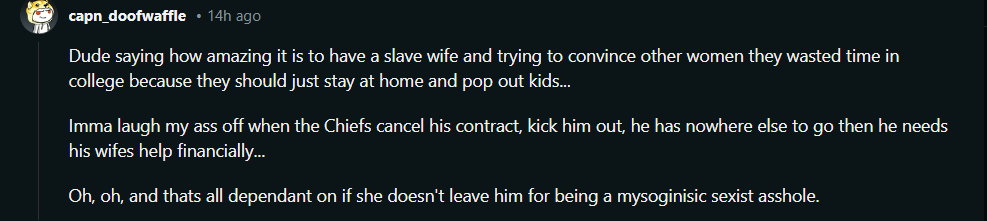

# Case: Attributed Quotes about Women and Gays

**Individual:** Harrison Butker

**False Claim:** "Women and gays are destroying society"

**Truth:** Investigation in progress (Schrödinger's Quotes)

**Evidence:**
1. **Image Evidence:** 

2. **meme source**:[reddit Someone is hurting society 🤔](https://www.reddit.com/r/FunnyandSad/comments/1ctlomw/someone_is_hurting_society/)

3. **Image Evidence:** 

4. **Video Evidence:** [Link to full speech](https://www.youtube.com/
watch?v=-JS7RIKSaCc)

5. **News Article:** [People Article](https://people.com/harrison-butker-nfl-does-not-share-views-in-graduation-speech-8649229)

**Status:**:
To summarize:

Truth: Butker's speech promotes traditional family roles and critiques modern societal changes from a conservative Catholic perspective.
Misinterpretation: The exact inflammatory quotes attributed to him in the meme and Reddit comment are not found in the transcript, indicating a degree of hyperbole and misrepresentation by his critics.
